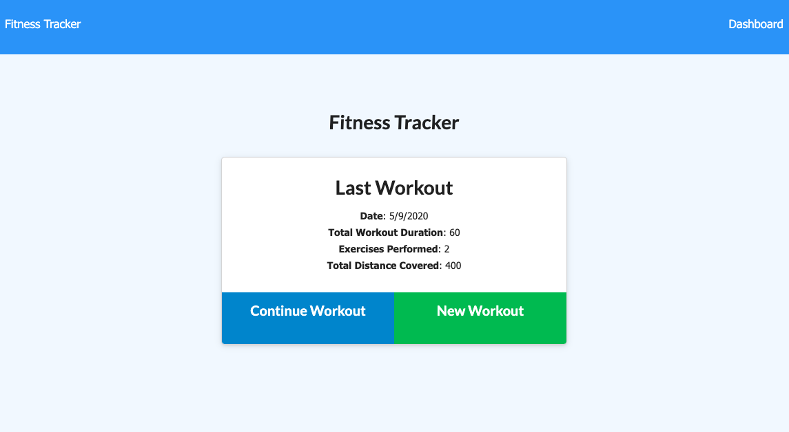
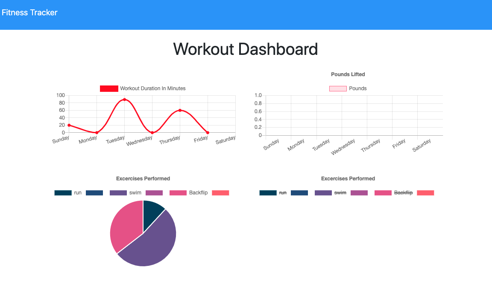

   
# Fitness-Tracker

## Description
This homework assignment focuses on adding and deleting and updating data using mongoDB. The workout data model includes date, exercise, and total duration values. These values contain information that is used to dynamically generate the data on the html pages. This application is hosted on Heroku and uses mLab to connect to a mongoDB.

## Installation

* Clone repo
* Install packages

## Usage 

Deployed application can be found here: https://fitness-tracker10101.herokuapp.com/

## Screenshots

